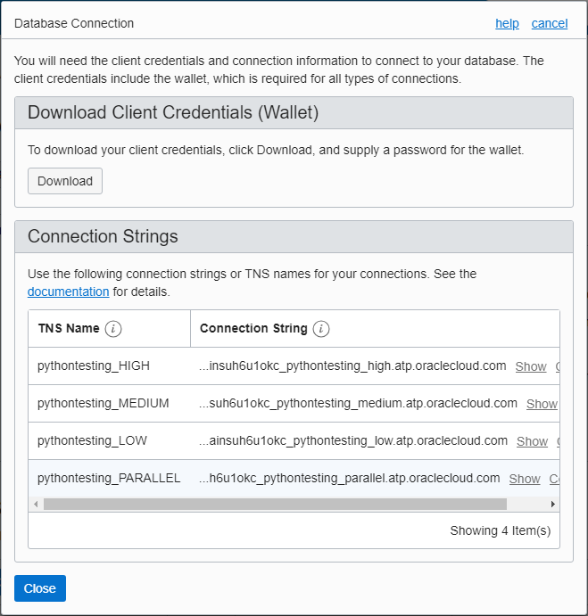
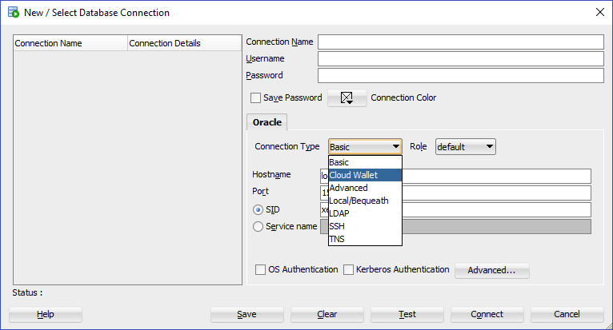
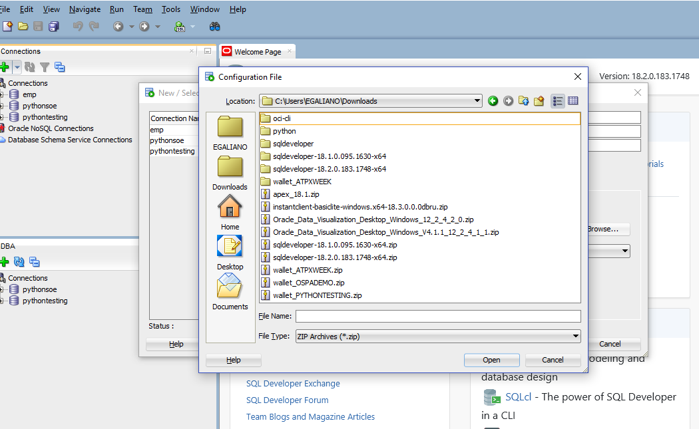
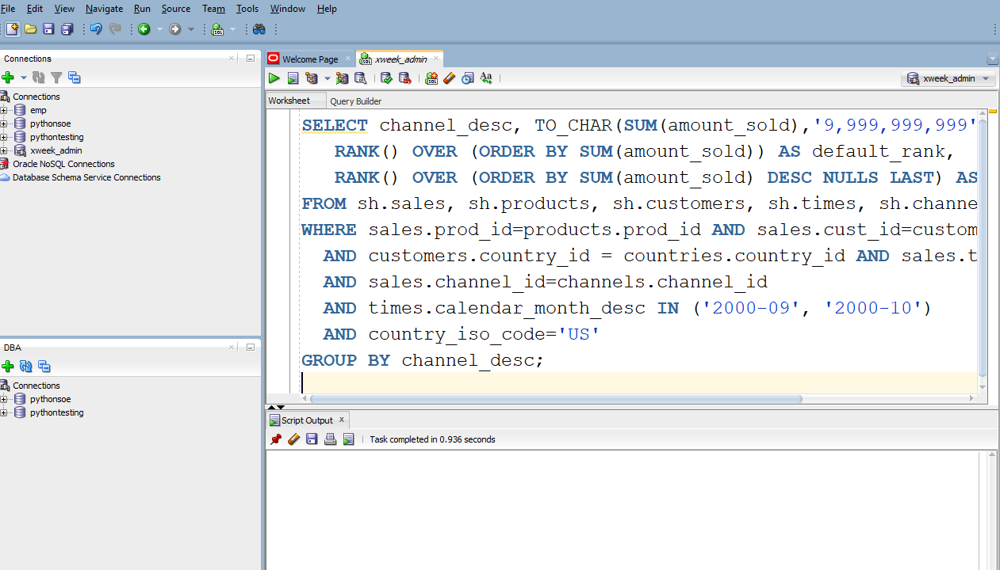
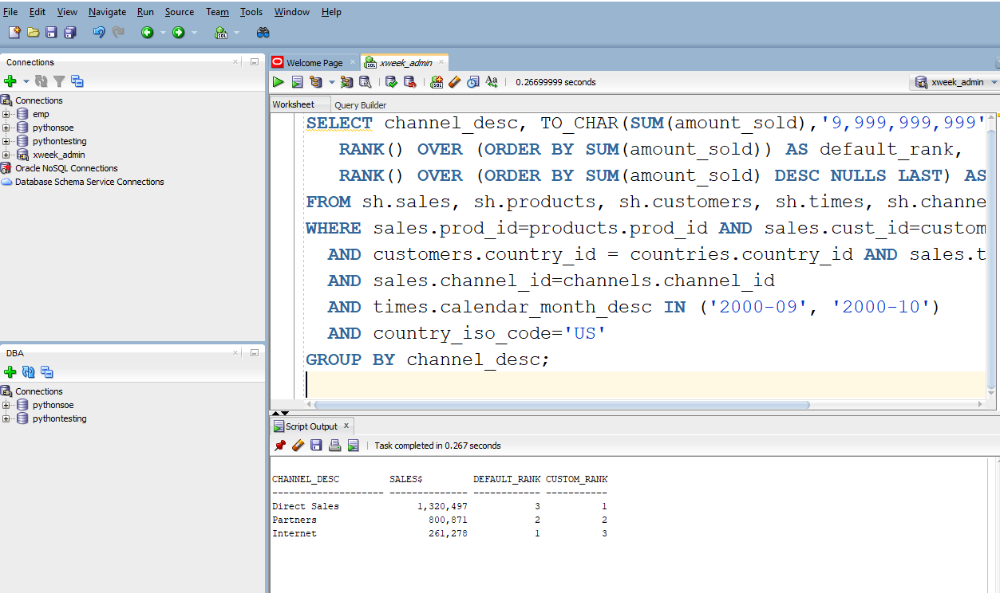
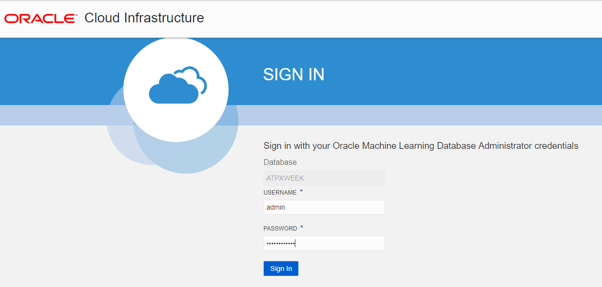
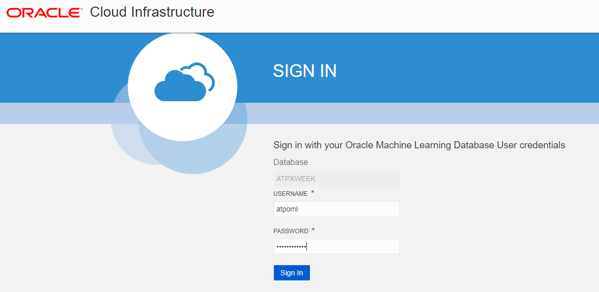

**Connecting to Autonomous Database**

**Objectives**

-   Learn how to download client credentials for your ATP instance

-   Explore credentials wallet file information

-   Connect to your ATP instance with SQL Developer

-   Connect to your ATP instance with Oracle ML Notebooks

Downloading the Client Credentials (wallet)
-------------------------------------------

The connection wallet provides the only authentication information that can be
used to connect to your ATP database. This wallet must be downloaded to the
client that will be connecting to the database. The wallet can be downloaded
from two locations, the Database Details page or the Service Console

The wallet is downloaded from the **Administration** page in the ATP service
console. Continuing from where we left off in the previous lab, select
**Download Client Credentials:**

Specify a password of your choice for the wallet. Note that this password is
separate from the **Admin** user password created earlier (but the same password
can be used). Make sure you know where the file gets downloaded to so you can
find in on your system.

**Alternatively** use the DB Connection button in the main Database Details page
to download the credentials:

Which opens up a screen where the Wallet can be downloaded as well as connection
strings be copied from (more on this in other modules)

Examining the Wallet File
-------------------------

Navigate to the location in your system where the file was downloaded (typically
your DOWNLOADS directory). In this example the file will be called
wallet_ATPXWEEK.zip, the format of the file is always “wallet_\$dbname.zip”.
Extract the contents of the wallet into a directory (using a zip utility,
usually by right clicking on the file), you will find the following files:

There are 4 files you will be working with during the different labs. Some tools
use the wallet file (.zip) and some use specific files contained in the wallet.
The files used in the labs are:

1.  **wallet_ATPXWEEK.zip** – the wallet itself

2.  **sqlnet.ora** – points to the location of the wallet for sqlnet connections

3.  **tnsnames.ora** – connection description for the database service (please
    note this file contains connection description for all the databases that
    exist in that cloud account)

4.  **ojdbc.properties** – points to the location of the wallet for jdbc
    connections

Connecting to the database using SQL Developer 
-----------------------------------------------

(Make sure you are running the latest version of SQL Developer 18.4. Some older versions will not work with ATP, see lab introductions on how to install)
---------------------------------------------------------------------------------------------------------------------------------------------------------

Start SQL Developer (by clicking the icon on your desktop or selecting from the
Windows Start menu) and create a connection for your database using the default
administrator account, ADMIN, by following these steps.

Click the Create Connection icon in the Connections toolbox on the top left of
the SQL Developer homepage.

The new Database Connection screen will appear:

Fill in the connection details as below:

Connection Name: **admin**

Username:** admin**

Password:** The admin password you specified during database provisioning**

Connection Type:** Cloud Wallet**

Configuration File:** Enter the full path for the wallet file you downloaded
before (in my example wallet_ATPXWEEK.zip), or click the Browse button to point
to the location of the file.**

**Service: **select the service configured specifically for ATP services, the
**\$dbname_TP** service, for you database. Many services may be listed but make
sure you pick the one for with the database name you created. In this example
its **atpxweek_TP.**

Test your connection by clicking the **Test** button, if it succeeds

Save your connection information by clicking **Save**

Connect to your database by clicking the **Connect** button.

See below for completed input and test. Notice also that after you save your
connection it will appear on the list of connections on the top left corner of
the main dashboard, under connections.

Now that you are connected run test a query. The ATP (or ADW) database you
created contains the sample Oracle Sales History (SH) schema, we will use this
schema to run a test query to make sure everything is working correctly. Copy
the SQL below and paste it on the query builder screen in SQL Developer (with
standard Windows copy and paste), then click F5 or the “Run Script” button as
indicated below. Make sure you are connected to your database, per the last step
on the previous process.

SELECT channel_desc, TO_CHAR(SUM(amount_sold),'9,999,999,999') SALES\$,  
RANK() OVER (ORDER BY SUM(amount_sold)) AS default_rank,  
RANK() OVER (ORDER BY SUM(amount_sold) DESC NULLS LAST) AS custom_rank  
FROM sh.sales, sh.products, sh.customers, sh.times, sh.channels, sh.countries  
WHERE sales.prod_id=products.prod_id AND sales.cust_id=customers.cust_id  
AND customers.country_id = countries.country_id AND sales.time_id=times.time_id  
AND sales.channel_id=channels.channel_id  
AND times.calendar_month_desc IN ('2000-09', '2000-10')  
AND country_iso_code='US'  
GROUP BY channel_desc;

And you will see the result of your query on the bottom **Script Output**
section

You have successfully connected and run an operation against ATP with SQL Developer. We will use SQL Developer throughout other labs. 
--------------------------------------------------------------------------------------------------------------------------------------

Connecting to the database using OML
------------------------------------

Another tool that can be used to connect and develop in ATP is the included
Oracle Machine Learning OML Notebook based environment. Because OML is easy to
access from anywhere and included with the ATP service it provides an easy and
fast environment to work with ATP. This browser-based application provides a web
interface to run SQL queries and scripts, which can be grouped together within a
notebook. Notebooks can be used to build single reports, collections of reports
and dashboards. OML provides a simple way to share workbooks with other OML
users.

OML Key Features
----------------

-   Collaborative SQL notebook UI for data scientists  

-   Packaged with Oracle Autonomous Transaction Processing Cloud Service

-   Easy access to shared notebooks, templates, permissions, scheduler, etc.

-   Access to 30+ parallel, scalable in-database implementations of [machine
    learning
    algorithms](https://docs.oracle.com/en/database/oracle/oracle-database/12.2/dmcon/algorithms.html#GUID-B901A29B-218C-4F37-91E0-AA94631364E3)

-   SQL and PL/SQL scripting language support

-   Enables and Supports Deployments of Enterprise Machine Learning
    Methodologies.

Once you have a database created in ATP, we need to create an OML user, which is
equivalent to creating a database user.

If you are not already logged into the ATP Service Console, in the main ATP
service page select Service Console:

On the next page log in with your ADMIN ATP user name/password and click **Sign
in:**

Select Administration from the top left and once on the Administration page
select **Manage Oracle ML Users**:

If required (you may not see this page), log into the OML Administration console
which is different than the database administration console but uses the same
ADMIN account created when the database was created. Fill in the **ADMIN
password** and click **Sign In**

Next create the actual OML user. Click the **Create** button:

This will open up the user creation page, fill in the information for your new
OML user and click **Create**. This is a completely new user account that will
be used anytime you want to access OML. Make sure you keep this information.
Notice that you can specify an email address where your user information and a
direct link to the OML login will be emailed to you. This will help you later
when you need to reconnect to OML.

**You now have a new OML user!** To connect to OML as your new user, click on
the Home Icon on the top right, pointed at by the arrow (or the link you
received by email). This will open up a new tab with the OML home page. This
time log in with the user you just created.

You are connected as an OML Notebook user. Run the same query we ran in SQL
Developer now in OML. Select **Run SQL Scripts** from Quick Actions:

Copy the same SQL statement you ran in SQL Developer above and paste it right
under the **%script** statement then select the **Run all Paragraphs** icon, as
shown below:

The results are shown below (and same as on SQL Developer):

You have successfully connected and run an operation against ATP with Oracle OML. We will use OML in other labs. 
-----------------------------------------------------------------------------------------------------------------
