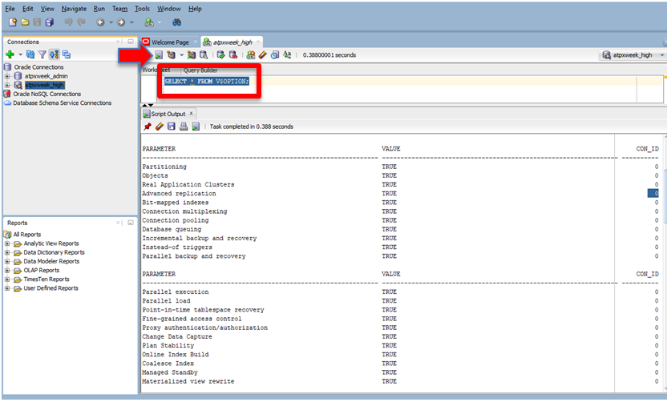
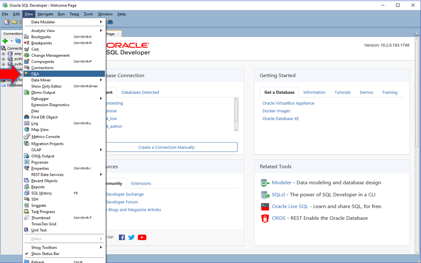
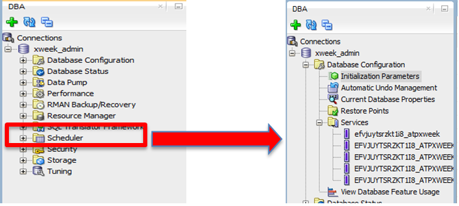
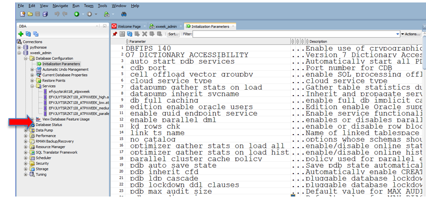
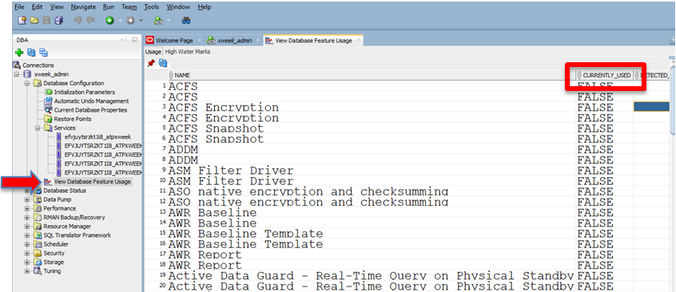
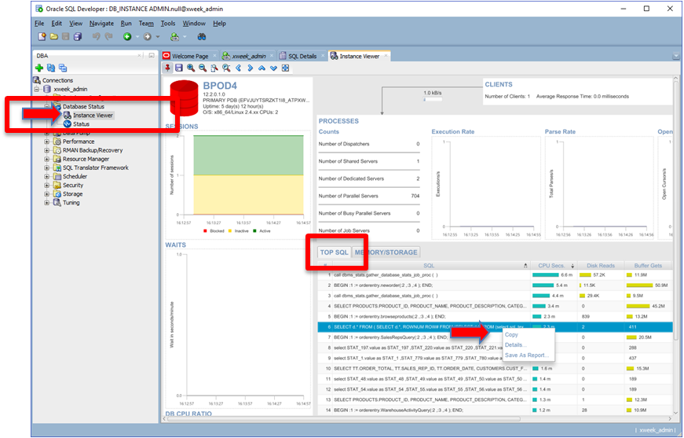
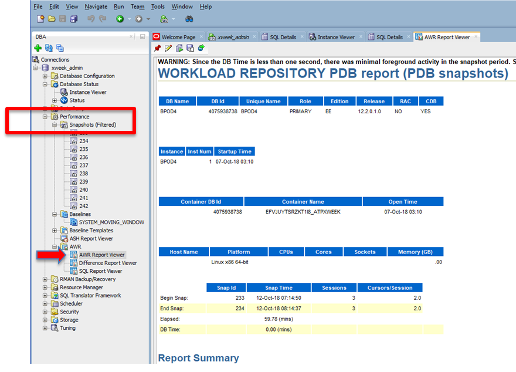
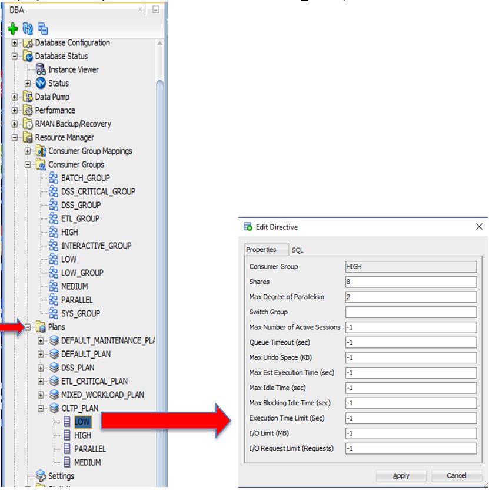
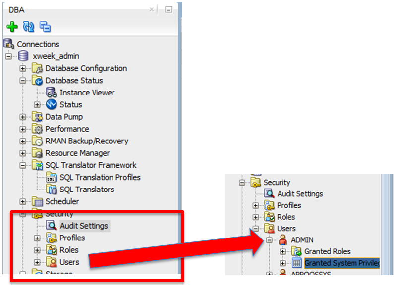

**DBA Exploration of ADB with SQL Developer**

**Objectives**

-   Explore the ADMIN view for ATB in SQL Developer

In this lab you will get an overview of the DBA view in SQL Developer and how to
explore configuration and settings in your ATB environment.

For this lab make sure you connect to Autonomous Database as “admin” user.
Regular user accounts will not be able to view any system configuration
information.

Start SQL Developer. Connect to your database like you did before (as admin).
One of the first questions DBA’s always ask is what options are available in
ATP. They can run the simple select from v\$option available in any Oracle
implementation to determine the options. In your SQL screen run the following
command to get a list of options in ATP.


```select \* from v\$option
```



Next you will examine the DBA view in SQL Developer. In the main screen select
**View-\>DBA. If you cannot see the DBA option under View, go to “Window” and
select “Reset Window to Factory Setting”,** this should let you see the DBA
option under View.



The DBA view appears on the bottom left. IF you have a connection box in the top
left (the box used for previous labs), close the connections box by clicking the
X on top right of the box. You should only see the DBA view. Below are
screenshots of both steps:


Click the connections green plus sign in the DBA view, it will pop up the
connections menu, select the connection you created for your admin database
connection (any service \_high or \_admin) and OK:


This will open up all the “DBA” views of the database, open Database
Configuration:



In **Initialization Parameters** (click it) you can view the parameters used for
this database.



In **Services** you can see five services configured and discussed in the
services lab.


In **View Database Features Usage** you can see the features currently in use.
As with other views, columns can be sorted, so for example you can sort the
CURRENTLY_USED column by TRUE to see all the features being used:



Open up **Database Status** and double click on **Instance Viewer.** This
displays a lot of information about the instance, usage and configuration as
well as the TOP SQL running on the instance. You can **select any SQL from TOP
SQL, left click and select Details**. This will create a new tab on the top
called SQL Details and put you in that tab. You can examine the SQL specifics
there.



The **Performance** section will contain information relating to how the
database is performing. The most familiar tool for DBA’s will be the AWR
reports, found under **AWR-\>AWR Report Viewer**



The **RMAN Backup/Recovery** contains information about scheduled backups,
backup sets, RMAN Settings and schedules. Customers and DBA’s often ask about
backups on ATP and those can be explored in more detail in this section. In the
screenshoot below the backup sets for this instance are displayed (your instance
may not display any backups since it was just created)


The **Resource Manager** contains information about different consumer groups
and plans defined, and the current plan in effect. Explore the entries here,
most of them will have contextual activities if you select and right click on
them. Under **Plans-\>OLTP_PLAN** you will find the current plan being used,
which you can verify by double clicking on **Settings**, the second to last
option under **Resource Manager.** This will display which plan is being used.
Under **OLTP_PLAN** if you select and right click on any of the plans, and
select **Edit Directives**, the specifics of the plan will be displayed. Below
you will see the screenshot for the **\_HIGH** plan.



The last entry under **Resource Manager-\>Statistics** provides graphical views
into system usage by plan user. Double click on Statistics and explore the
different screens.

The **Security** section will be very useful to DBA’s as they can explore all
the Profiles, and Roles defined in the system, and under **Users,** roles and
system priviledges granted to the user. Spend some time examining this area.



The **Storage** section can be used to display all the storage characteristics
of the ATP database. Most of these characteristics cannot be changed, as the
Autonomous Database automatically manages and optimizes storage for the service.
However the configurations can be examined. For example any data in a database
will be stored in the DATA Tablespace. Below is a screenshot of the parameters
of the DATA Tablespace (Expand Tablespaces and then double click on DATA to
see). Examine the different entries in this area.


This concludes the SQL Developer Lab. SQL Developer is a very comprehensive
powerful tool and you should continue to explore the different benefits it
offers. Continue to look at all the attributes in the DBA view to see what else
you can find out about your ADB instance.
