Loading Data Into Autonomous Database
=====================================

This lab shows you how to load data from an Oracle Object Store into a database
in Autonomous Database.

You can load data into Autonomous Database using Oracle Database tools, and
Oracle and 3rd party data integration tools. You can load data:

-   from files local to your client computer, or

-   from files stored in a cloud-based object store

For the fastest data loading experience Oracle recommends uploading the source
files to a cloud-based object store, such as Oracle Cloud Infrastructure Object
Storage, before loading the data into your Autonomous Database.

To load data from files in the cloud into your Autonomous database, use the new
PL/SQL **DBMS_CLOUD** package. The DBMS_CLOUD package supports loading data
files from the following Cloud sources: Oracle Cloud Infrastructure Object
Storage, Oracle Cloud Infrastructure Object Storage Classic, and Amazon AWS S3.

This tutorial shows how to load data from Oracle Cloud Infrastructure Object
Storage using two of the procedures in the DBMS_CLOUD package:

-   create_credential: Stores the object store credentials in your Autonomous
    Database.

    -   You will use this procedure to create object store credentials in your
        Autonomous Database.

-   copy_data: Loads the specified source file to a table. The table must
    already exist in Autonomous Database (we will create the tables in this
    lab).

    -   You will use this procedure to load tables with data from data files
        staged in the Oracle Cloud Infrastructure Object Storage cloud service.

    -   This tutorial shows how to load data to SH tables (sales history tables
        from an Oracle sample schema: SALES, COSTS, TIMES, PRODUCTS, CHANNELS,
        PROMOTIONS, CUSTOMERS, COUNTRIES, SUPPLEMENTARY_DEMOGRAPHICS).

    -   For more information about loading data, see the documentation [Loading
        Data from Files in the
        Cloud](https://www.oracle.com/pls/topic/lookup?ctx=en/cloud/paas/autonomous-data-warehouse-cloud&id=CSWHU-GUID-07900054-CB65-490A-AF3C-39EF45505802).

Upload Data Files to Your Object Store
--------------------------------------

Upload to your cloud-based object store the data files that you want to load to
your Autonomous Data Warehouse database. This tutorial uses an object store in
the Oracle Cloud Infrastructure Object Storage service.

>   Log in to your Oracle Cloud Infrastructure Console (refer to first lab for
>   steps)

>   Select Service-\>Compute from the drop down on the top left of the Oracle
>   Cloud Infrastructure console

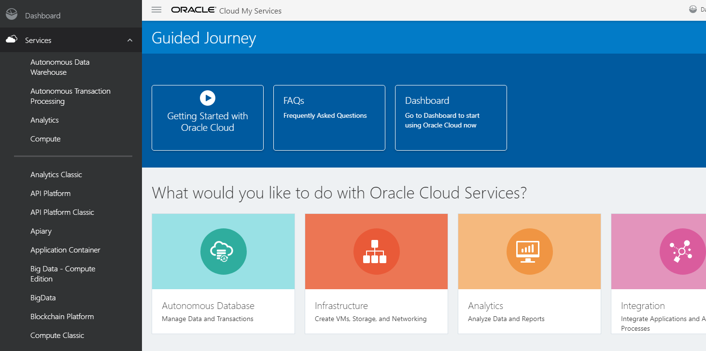

>   Select **Object Storage** from the menu at the top left of the Oracle Cloud
>   Infrastructure console. Select **Object Storage** from the sub-menu. 

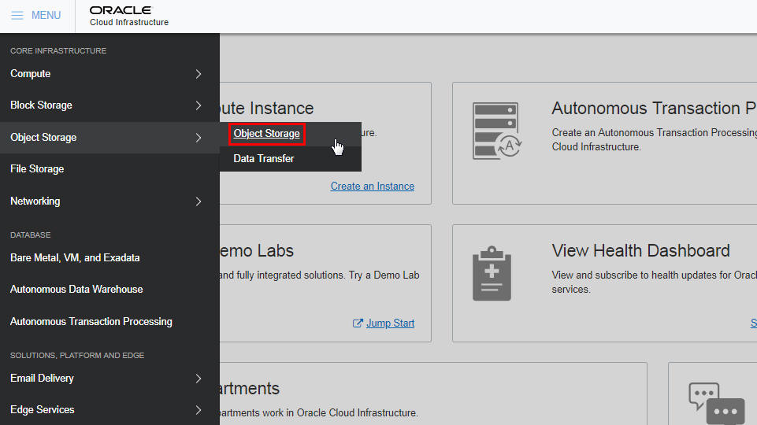

>   select Object Storage

>   Select a compartment in which to create a bucket to upload your database
>   table data. For this exercise leave at the default compartment. However if
>   you want to experiment with compartments you can do so and select whatever
>   compartment you wish.

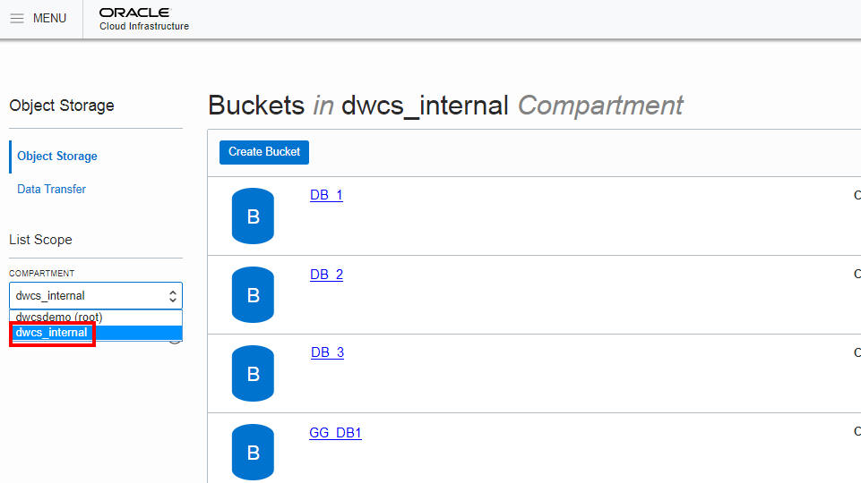

>   select a compartment

>   Click **Create Bucket** to create the storage bucket in which to upload your
>   source files. You will later copy this staged data into database tables in
>   your Autonomous Database. 

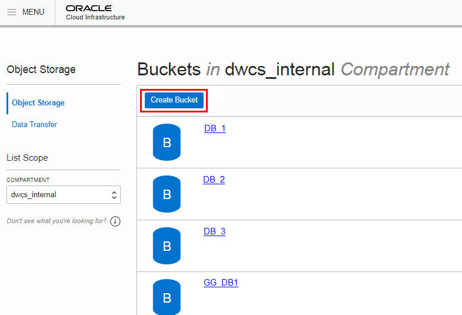

>   create a bucket

>   Enter a bucket name, select the standard storage tier, Encrypt using Oracle
>   Managed Keys, and click **Create Bucket**.

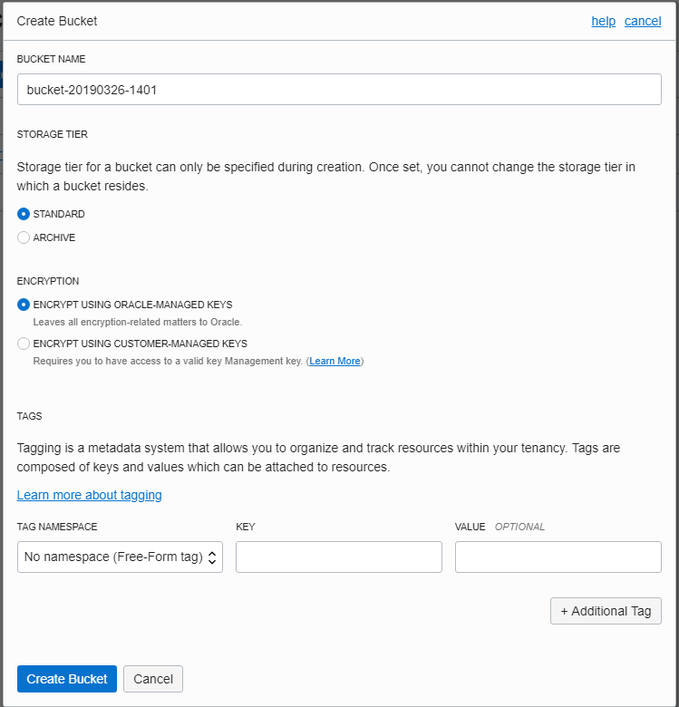

>   When the bucket is created you will see all buckets that have been created
>   including yours. Click on the bucket name you just created

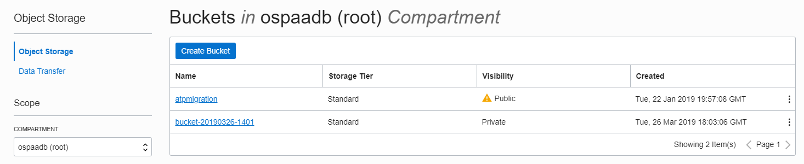

>   Click **Upload Object** to begin selecting the data files to upload to the
>   bucket.

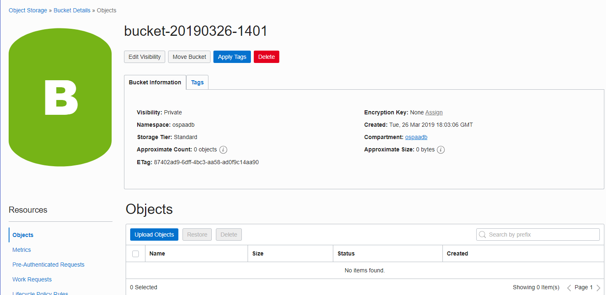

>   Navigate to the location of the data files on your local computer. Drag and
>   drop each file or click **Upload Object** to upload each file individually.  
>   This example uploads the data files of the SH tables (sales history tables
>   from an Oracle sample schema). Click
>   [here](https://www.oracle.com/webfolder/technetwork/tutorials/obe/cloud/adwc/OBE_Loading%20Your%20Data/files/datafiles_for_sh_tables.zip)
>   to download a zipfile of the 10 SH data files for you to upload to the
>   object store. Download the zip file to your computer then extract the zip
>   file, you will upload these files into the object store.

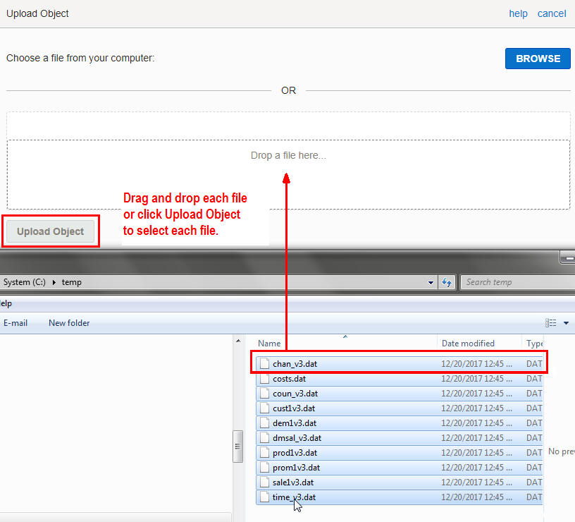

>   upload data files to bucket

>   The data files are uploaded to the bucket. These files staged in the cloud
>   are ready to be copied into the tables of your Autonomous Database. Remain
>   logged in to Oracle Cloud Infrastructure Object Storage.

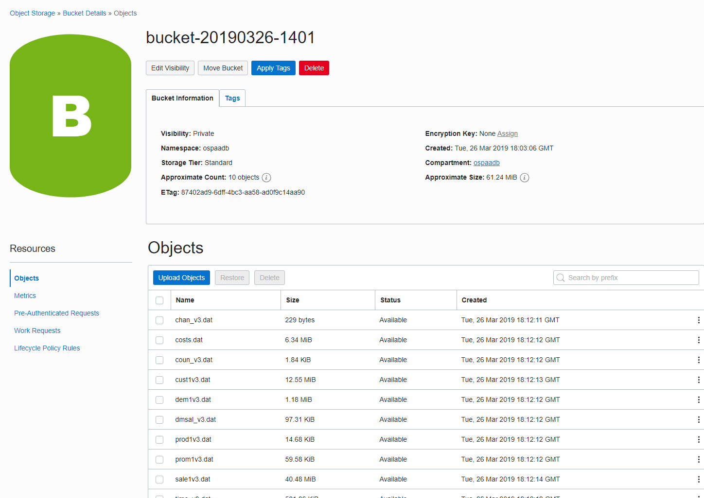

>   The next step for is to make the bucket visible for loading. In this case we
>   will make it public to make it easier to load and access all the files. In
>   the same page above, Objects, click Edit Visibility and select Public and
>   then Save Changes.

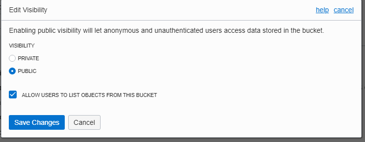

Create an Object Store Auth Token
---------------------------------

To load data from an Oracle Cloud Infrastructure Object Storage object store,
you need to create an Auth Token for your object store account. The
communication between your Autonomous Database and the object store relies on
the Auth Token and username/password authentication.

>   If you have logged out of Oracle Cloud Infrastructure Object Storage, log
>   back in.

>   From the menu on the top left select Identity and users. Once on the Users
>   Page click on your username

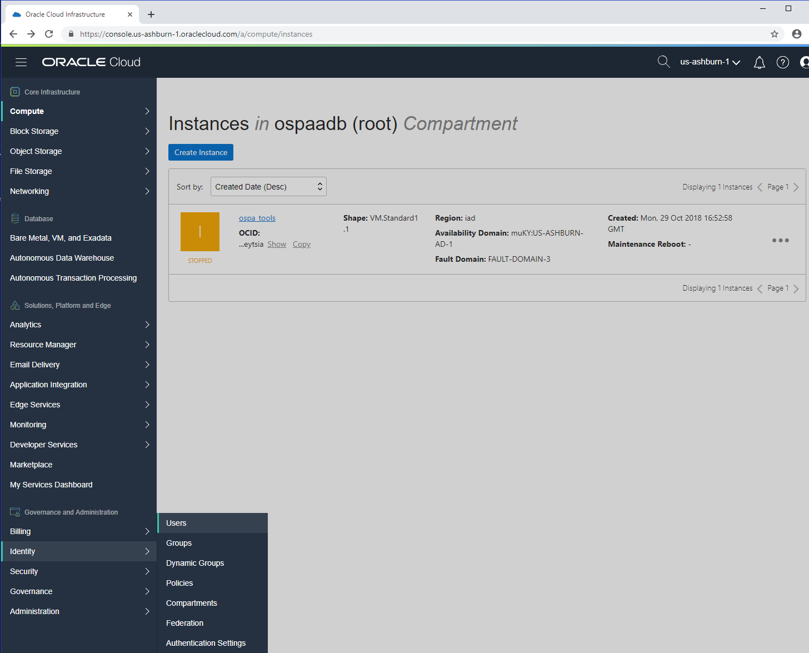

>   Click **Auth Tokens** under **Resources** on the left of the console.

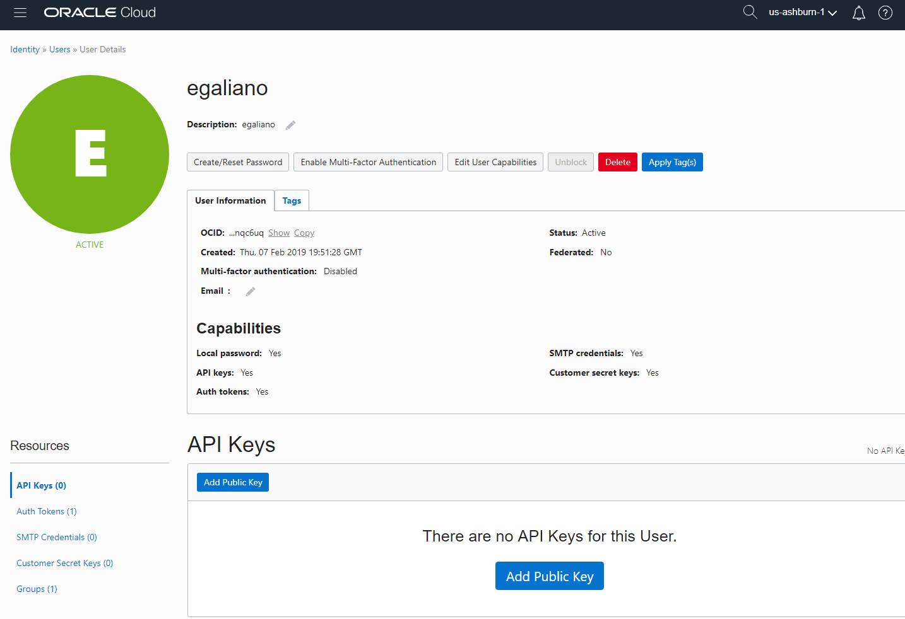

>   Click **Generate Token**.

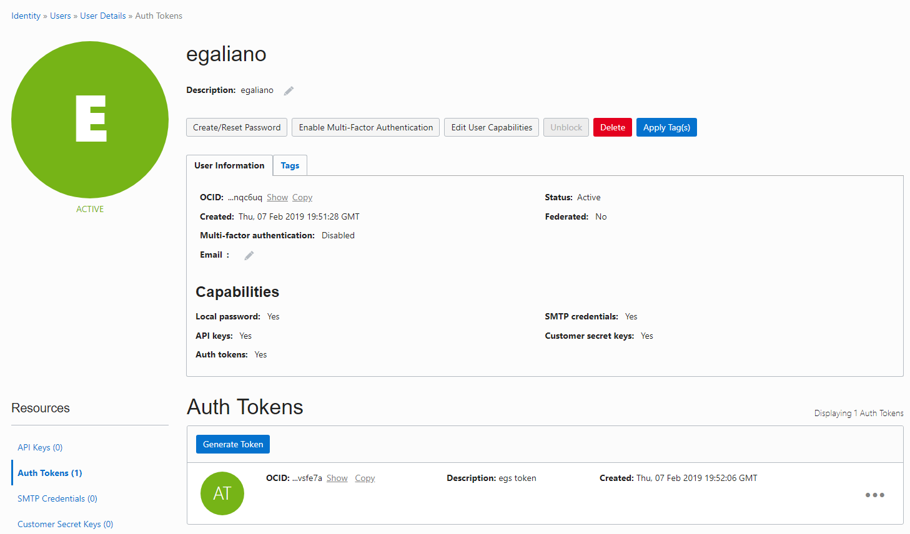

>   A pop-up dialog appears. Set the Auth Token by performing the following
>   steps:

>   In the pop-up dialog, enter a description.

>   Click the **Generate Token** button.

>   Copy the generated token to a text file. The token does not appear again and
>   you WILL NEED this token.

>   Click **Close**.

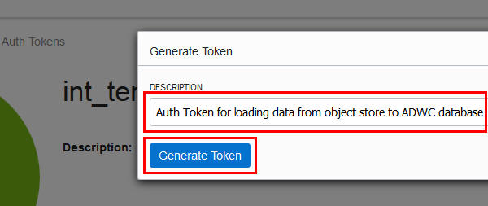

>   enter description and click Generate Token

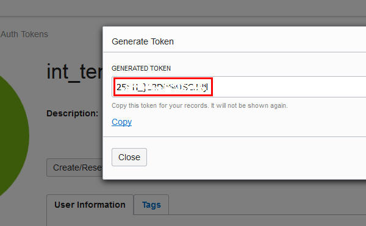

>   copy the generated token

Create Object Store Credentials in your Autonomous Database
-----------------------------------------------------------

Now that you have created an object store Auth Token, store in your Autonomous
database the credentials of the object store in which your data is staged.

>   Open SQL Developer and connect to your Autonomous Database as user admin
>   with the connection you created in the Connecting to ADB Lab

>   In a SQL Developer worksheet, use the create_credential procedure of the
>   DBMS_CLOUD package to store the object store credentials in your database

>   Create a credential name. You reference this credential name in the
>   copy_data procedure in the next step.

>   Specify the credentials for your Oracle Cloud Infrastructure Object Storage
>   service: The username is your Oracle Cloud Login and the object store Auth
>   Token you generated in the previous step.

>   begin  
>   DBMS_CLOUD.create_credential (  
>   credential_name =\> 'OBJ_STORE_CRED',  
>   username =\> '\<your username\>',  
>   password =\> '\<your Auth Token\>'  
>   ) ;  
>   end;  
>   /

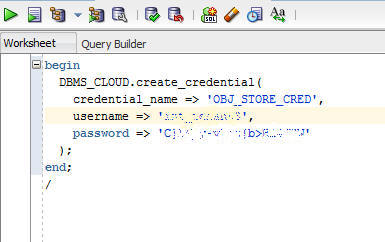

>   create credential in ADWC schema

>   After you run this script, your object store's credentials are stored in
>   your Autonomous Database.

Copy Data from Object Store to Autonomous Database Tables
---------------------------------------------------------

The copy_data procedure of the DBMS_CLOUD package requires that target tables
must already exist in in your Autonomous database. To create the appropriate
tables, run the code below in SQL Developer, copy and paste all this code into
the SQL worksheet in SQL Developer and click run script.

CREATE TABLE sales (

prod_id NUMBER NOT NULL,

cust_id NUMBER NOT NULL,

time_id DATE NOT NULL,

channel_id NUMBER NOT NULL,

promo_id NUMBER NOT NULL,

quantity_sold NUMBER(10,2) NOT NULL,

amount_sold NUMBER(10,2) NOT NULL);

CREATE TABLE salestemp (

prod_id NUMBER NOT NULL,

cust_id NUMBER NOT NULL,

time_id DATE NOT NULL,

channel_id NUMBER NOT NULL,

promo_id NUMBER NOT NULL,

quantity_sold NUMBER(10,2) NOT NULL,

amount_sold NUMBER(10,2) NOT NULL,

unit_cost NUMBER(10,2) ,

unit_price NUMBER(10,2) );

CREATE TABLE costs (

prod_id NUMBER NOT NULL,

time_id DATE NOT NULL,

promo_id NUMBER NOT NULL,

channel_id NUMBER NOT NULL,

unit_cost NUMBER(10,2) NOT NULL,

unit_price NUMBER(10,2) NOT NULL);

CREATE TABLE times (

time_id DATE NOT NULL,

day_name VARCHAR2(9) NOT NULL,

day_number_in_week NUMBER(1) NOT NULL,

day_number_in_month NUMBER(2) NOT NULL,

calendar_week_number NUMBER(2) NOT NULL,

fiscal_week_number NUMBER(2) NOT NULL,

week_ending_day DATE NOT NULL,

week_ending_day_id NUMBER NOT NULL,

calendar_month_number NUMBER(2) NOT NULL,

fiscal_month_number NUMBER(2) NOT NULL,

calendar_month_desc VARCHAR2(8) NOT NULL,

calendar_month_id NUMBER NOT NULL,

fiscal_month_desc VARCHAR2(8) NOT NULL,

fiscal_month_id NUMBER NOT NULL,

days_in_cal_month NUMBER NOT NULL,

days_in_fis_month NUMBER NOT NULL,

end_of_cal_month DATE NOT NULL,

end_of_fis_month DATE NOT NULL,

calendar_month_name VARCHAR2(9) NOT NULL,

fiscal_month_name VARCHAR2(9) NOT NULL,

calendar_quarter_desc CHAR(7) NOT NULL,

calendar_quarter_id NUMBER NOT NULL,

fiscal_quarter_desc CHAR(7) NOT NULL,

fiscal_quarter_id NUMBER NOT NULL,

days_in_cal_quarter NUMBER NOT NULL,

days_in_fis_quarter NUMBER NOT NULL,

end_of_cal_quarter DATE NOT NULL,

end_of_fis_quarter DATE NOT NULL,

calendar_quarter_number NUMBER(1) NOT NULL,

fiscal_quarter_number NUMBER(1) NOT NULL,

calendar_year NUMBER(4) NOT NULL,

calendar_year_id NUMBER NOT NULL,

fiscal_year NUMBER(4) NOT NULL,

fiscal_year_id NUMBER NOT NULL,

days_in_cal_year NUMBER NOT NULL,

days_in_fis_year NUMBER NOT NULL,

end_of_cal_year DATE NOT NULL,

end_of_fis_year DATE NOT NULL );

CREATE TABLE products (

prod_id NUMBER(6) NOT NULL,

prod_name VARCHAR2(50) NOT NULL,

prod_desc VARCHAR2(4000) NOT NULL,

prod_subcategory VARCHAR2(50) NOT NULL,

prod_subcategory_id NUMBER NOT NULL,

prod_subcategory_desc VARCHAR2(2000) NOT NULL,

prod_category VARCHAR2(50) NOT NULL,

prod_category_id NUMBER NOT NULL,

prod_category_desc VARCHAR2(2000) NOT NULL,

prod_weight_class NUMBER(3) NOT NULL,

prod_unit_of_measure VARCHAR2(20) ,

prod_pack_size VARCHAR2(30) NOT NULL,

supplier_id NUMBER(6) NOT NULL,

prod_status VARCHAR2(20) NOT NULL,

prod_list_price NUMBER(8,2) NOT NULL,

prod_min_price NUMBER(8,2) NOT NULL,

prod_total VARCHAR2(13) NOT NULL,

prod_total_id NUMBER NOT NULL,

prod_src_id NUMBER ,

prod_eff_from DATE ,

prod_eff_to DATE ,

prod_valid VARCHAR2(1) );

CREATE TABLE channels (

channel_id NUMBER NOT NULL,

channel_desc VARCHAR2(20) NOT NULL,

channel_class VARCHAR2(20) NOT NULL,

channel_class_id NUMBER NOT NULL,

channel_total VARCHAR2(13) NOT NULL,

channel_total_id NUMBER NOT NULL);

CREATE TABLE promotions (

promo_id NUMBER(6) NOT NULL,

promo_name VARCHAR2(30) NOT NULL,

promo_subcategory VARCHAR2(30) NOT NULL,

promo_subcategory_id NUMBER NOT NULL,

promo_category VARCHAR2(30) NOT NULL,

promo_category_id NUMBER NOT NULL,

promo_cost NUMBER(10,2) NOT NULL,

promo_begin_date DATE NOT NULL,

promo_end_date DATE NOT NULL,

promo_total VARCHAR2(15) NOT NULL,

promo_total_id NUMBER NOT NULL);

CREATE TABLE customers (

cust_id NUMBER NOT NULL,

cust_first_name VARCHAR2(20) NOT NULL,

cust_last_name VARCHAR2(40) NOT NULL,

cust_gender CHAR(1) NOT NULL,

cust_year_of_birth NUMBER(4) NOT NULL,

cust_marital_status VARCHAR2(20) ,

cust_street_address VARCHAR2(40) NOT NULL,

cust_postal_code VARCHAR2(10) NOT NULL,

cust_city VARCHAR2(30) NOT NULL,

cust_city_id NUMBER NOT NULL,

cust_state_province VARCHAR2(40) NOT NULL,

cust_state_province_id NUMBER NOT NULL,

country_id NUMBER NOT NULL,

cust_main_phone_number VARCHAR2(25) NOT NULL,

cust_income_level VARCHAR2(30) ,

cust_credit_limit NUMBER ,

cust_email VARCHAR2(50) ,

cust_total VARCHAR2(14) NOT NULL,

cust_total_id NUMBER NOT NULL,

cust_src_id NUMBER ,

cust_eff_from DATE ,

cust_eff_to DATE ,

cust_valid VARCHAR2(1) );

CREATE TABLE countries (

country_id NUMBER NOT NULL,

country_iso_code CHAR(2) NOT NULL,

country_name VARCHAR2(40) NOT NULL,

country_subregion VARCHAR2(30) NOT NULL,

country_subregion_id NUMBER NOT NULL,

country_region VARCHAR2(20) NOT NULL,

country_region_id NUMBER NOT NULL,

country_total VARCHAR2(11) NOT NULL,

country_total_id NUMBER NOT NULL,

country_name_hist VARCHAR2(40));

CREATE TABLE supplementary_demographics

( CUST_ID NUMBER not null,

EDUCATION VARCHAR2(21),

OCCUPATION VARCHAR2(21),

HOUSEHOLD_SIZE VARCHAR2(21),

YRS_RESIDENCE NUMBER,

AFFINITY_CARD NUMBER(10),

bulk_pack_diskettes NUMBER(10),

flat_panel_monitor NUMBER(10),

home_theater_package NUMBER(10),

bookkeeping_application NUMBER(10),

printer_supplies NUMBER(10),

y_box_games NUMBER(10),

os_doc_set_kanji NUMBER(10),

COMMENTS VARCHAR2(4000));

ALTER TABLE promotions

ADD CONSTRAINT promo_pk

PRIMARY KEY (promo_id)

RELY DISABLE NOVALIDATE;

ALTER TABLE sales

ADD CONSTRAINT sales_promo_fk

FOREIGN KEY (promo_id) REFERENCES promotions (promo_id)

RELY DISABLE NOVALIDATE;

ALTER TABLE costs

ADD CONSTRAINT costs_promo_fk

FOREIGN KEY (promo_id) REFERENCES promotions (promo_id)

RELY DISABLE NOVALIDATE;

ALTER TABLE customers

ADD CONSTRAINT customers_pk

PRIMARY KEY (cust_id)

RELY DISABLE NOVALIDATE;

ALTER TABLE sales

ADD CONSTRAINT sales_customer_fk

FOREIGN KEY (cust_id) REFERENCES customers (cust_id)

RELY DISABLE NOVALIDATE;

ALTER TABLE products

ADD CONSTRAINT products_pk

PRIMARY KEY (prod_id)

RELY DISABLE NOVALIDATE;

ALTER TABLE sales

ADD CONSTRAINT sales_product_fk

FOREIGN KEY (prod_id) REFERENCES products (prod_id)

RELY DISABLE NOVALIDATE;

ALTER TABLE costs

ADD CONSTRAINT costs_product_fk

FOREIGN KEY (prod_id) REFERENCES products (prod_id)

RELY DISABLE NOVALIDATE;

ALTER TABLE times

ADD CONSTRAINT times_pk

PRIMARY KEY (time_id)

RELY DISABLE NOVALIDATE;

ALTER TABLE sales

ADD CONSTRAINT sales_time_fk

FOREIGN KEY (time_id) REFERENCES times (time_id)

RELY DISABLE NOVALIDATE;

ALTER TABLE costs

ADD CONSTRAINT costs_time_fk

FOREIGN KEY (time_id) REFERENCES times (time_id)

RELY DISABLE NOVALIDATE;

ALTER TABLE channels

ADD CONSTRAINT channels_pk

PRIMARY KEY (channel_id)

RELY DISABLE NOVALIDATE;

ALTER TABLE sales

ADD CONSTRAINT sales_channel_fk

FOREIGN KEY (channel_id) REFERENCES channels (channel_id)

RELY DISABLE NOVALIDATE;

ALTER TABLE costs

ADD CONSTRAINT costs_channel_fk

FOREIGN KEY (channel_id) REFERENCES channels (channel_id)

RELY DISABLE NOVALIDATE;

ALTER TABLE countries

ADD CONSTRAINT countries_pk

PRIMARY KEY (country_id)

RELY DISABLE NOVALIDATE;

ALTER TABLE customers

ADD CONSTRAINT customers_country_fk

FOREIGN KEY (country_id) REFERENCES countries (country_id)

RELY DISABLE NOVALIDATE;

ALTER TABLE supplementary_demographics

ADD CONSTRAINT supp_demo_pk

PRIMARY KEY (cust_id)

RELY DISABLE NOVALIDATE;

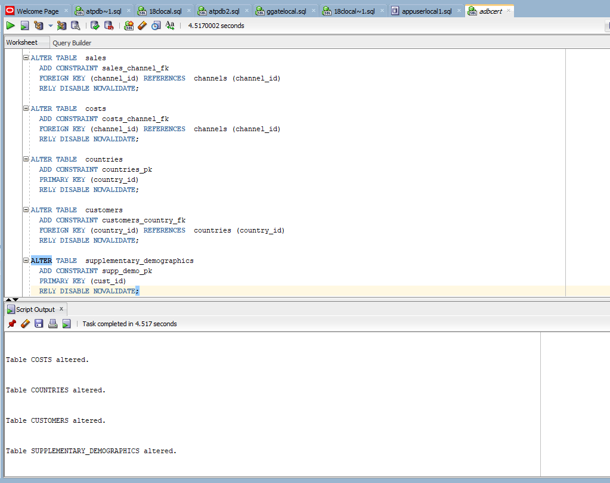

Now run the copy_data procedure to copy the data staged in your object store to
your Autonomous Database tables. 

In a SQL Developer worksheet, use the copy_data procedure of the DBMS_CLOUD
package to copy the data staged in your object store.

For credential_name, specify the name of the credential you defined in the
Create Object Store Credentials earlier.

For file_uri_list, specify the URL that points to the location of the file
staged in your object store. See screenshots below for how to obtain this.

[Click
here](https://www.oracle.com/webfolder/technetwork/tutorials/obe/cloud/adwc/OBE_Loading%20Your%20Data/files/data%20loading%20script.txt)
for an example script. In the script, the only line you need to change for each
table is the file_uri_list parameter IF the credential you created is called
OBJ_STORE_CRED. If you called your credential a different name, you also need to
change the credential_name line.

To obtain the file_uri_list for each file you want to load, go to your storage
bucket (as described above when you created it), and for each object to load,
click on the 3 dots to the right and select, View Object Details:

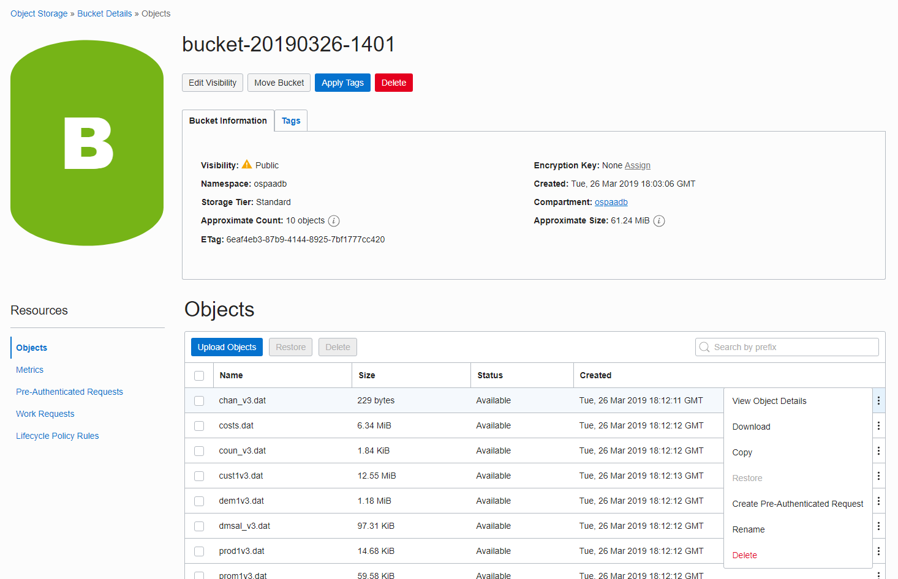

The object details windows appears, copy the URL Path (URI), then past this on
the corresponding dbms_cloud.copy_data statement as shown below

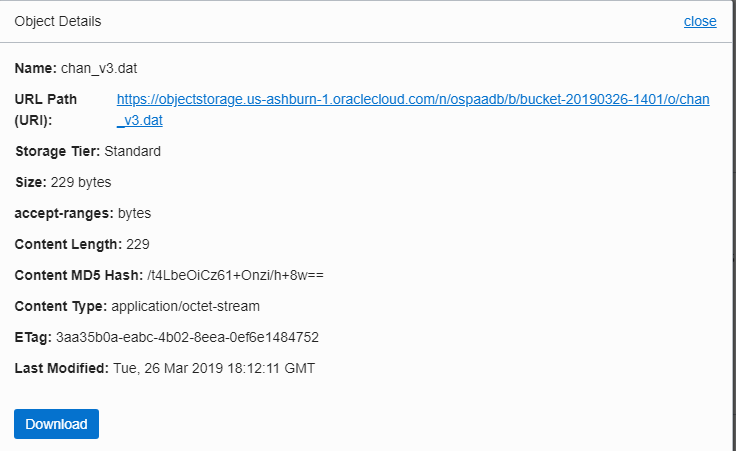

begin

dbms_cloud.copy_data(

table_name =\>'CHANNELS',

credential_name =\>'OBJ_STORE_CRED',

file_uri_list
=\>'https://objectstorage.us-ashburn-1.oraclecloud.com/n/ospaadb/b/bucket-20190326-1401/o/chan_v3.dat',

format =\> json_object('ignoremissingcolumns' value 'true', 'removequotes' value
'true')

);

end;

/

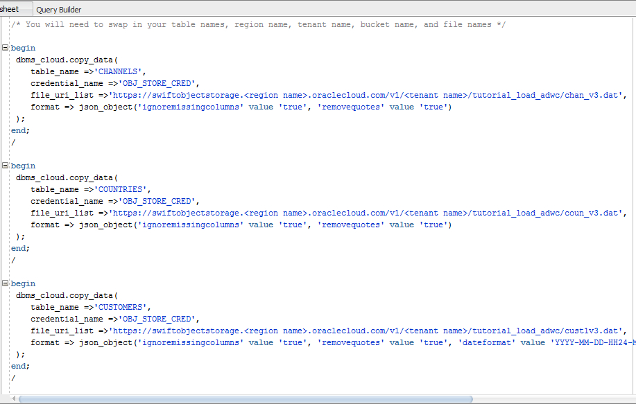

After you run the procedure, observe that the data has been copied from the
object store to the tables in your Autonomous database by clicking the table
name in SQL Developer

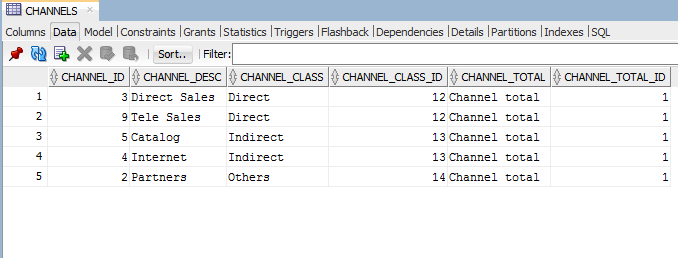

Confirm Your Data Load
----------------------

All data load operations done using the PL/SQL package DBMS_CLOUD are logged in
the tables dba_load_operations and user_load_operations. These tables contain
the following:

-   dba_load_operations: shows all load operations.

-   user_load_operations: shows the load operations in your schema.

>   Query these tables to see information about ongoing and completed data
>   loads. For example:

>   SELECT table_name, owner_name, type, status, start_time, update_time,  
>   logfile_table, badfile_table

>   FROM user_load_operations WHERE type = 'COPY';

>   Examine the results. The log and bad files are accessible as tables:

>   TABLE_NAME STATUS ROWS_LOADED LOGFILE_TABLE   BADFILE_TABLE  
>   ---------- ------------ ----------- -------------   -------------  
>   CHANNELS FAILED COPY\$1_LOG      COPY\$1_BAD  
>   CHANNELS COMPLETED 5   COPY\$2_LOG COPY\$2_BAD
