### Provisioning an Autonomous Database

**Objectives**

-   Learn how to login to the Oracle Cloud Console

-   Learn how to provision a new Autonomous Database

In this section you will be provisioning an ATP database using the cloud
console.

Go to [cloud.oracle.com](https://cloud.oracle.com), click Sign In to sign in
with your Oracle Cloud account.

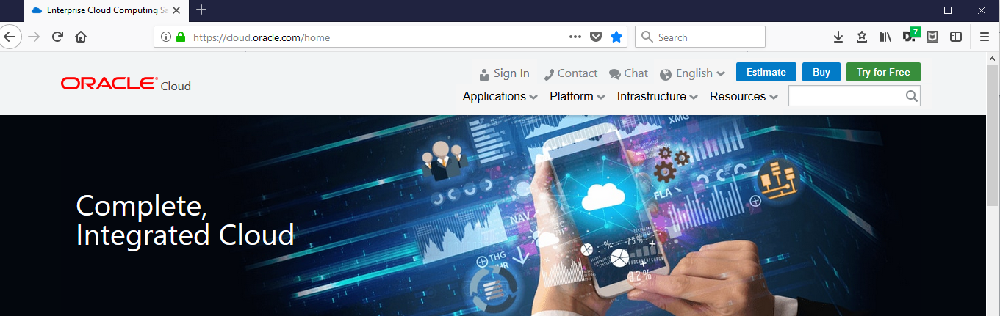

Enter your Cloud Account Name and click **Next**.

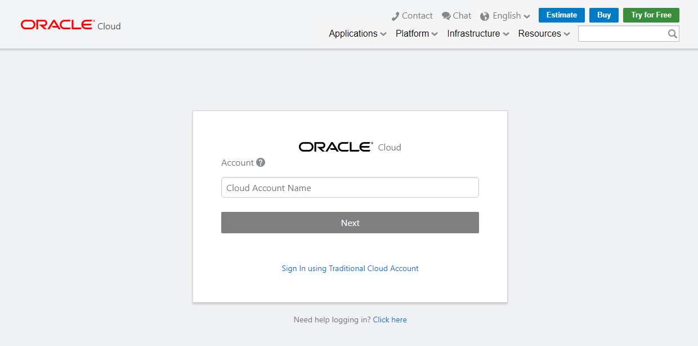

Enter your Cloud username and password, and click Sign In. In this example, the
Cloud username is *adw_admin*.

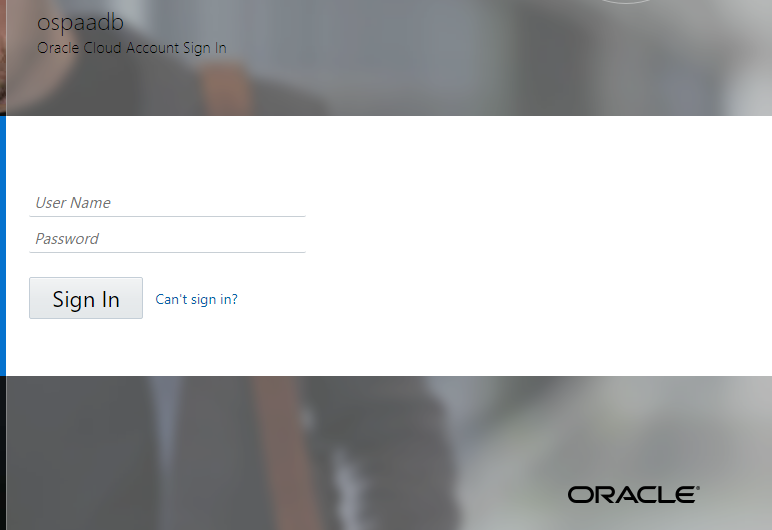

This will bring you to the main cloud page which may differ depending on whether
this cloud account has been used before and the main portal customized. Below
you will see the main screen for a new account, that shows available Guided
Journey’s. From here you can launch different Oracle cloud services. From the
top left select the drop down menu highlighted in red:

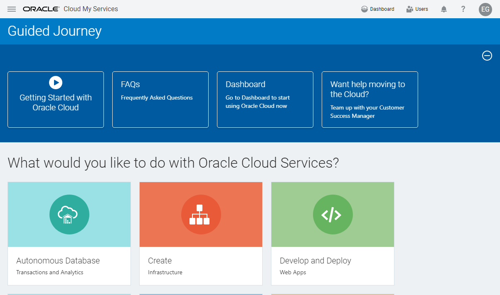

Select **Autonomous Transaction Processing** from the drop down menu

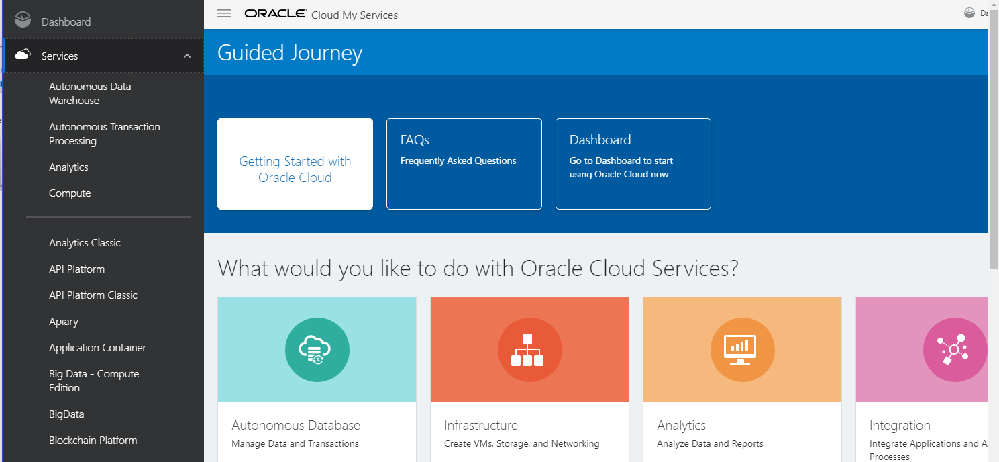

This will put you in the main Autonomous Database Service Console (see below).
Any ADB Databases created will be listed here. You can also create and access
databases from this page.

It is possible to use different compartments to separate databases into
different associated groups, we will use the default compartment, so no change
just fyi:

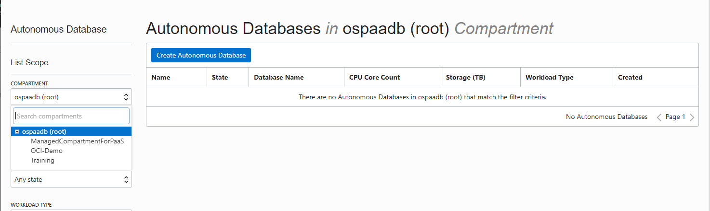

Click on the “**Create Autonomous Transaction Processing Database**” button, as
shown below:

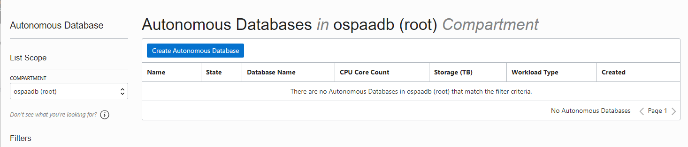

The following information must be filled in this page:

**Workload Type-** Autonomous Data Warehouse or Autonomous Transaction
Processing

**Compartment** – This can be changed, to organize and isolate databases

**Display Name –** The name of the service displayed

**Database Name –** The name of the actual database

**CPU Core Count –** Number of CPU’s allocated to the database (min 1)

**Storage –** Storage allocated to database in Terabytes (min 1)

**Password –** Database “Admin” user password

**License Type –** Select whether customer is using existing on-premises
database licenses (BYOL) or requires new licences. Customer charge will be based
on selected option

**TAGS –** a metadata system that allows you to organize and track resources
within your tenancy. Tags are composed of keys and values that can be attached
to resources.

After filling fields, click **Create Autonomous Database** which will open up
the screen to complete you database information:

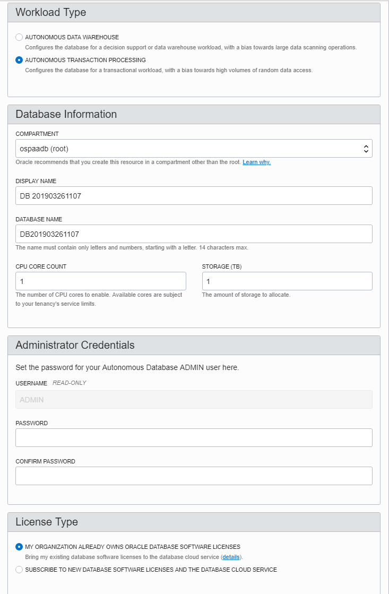

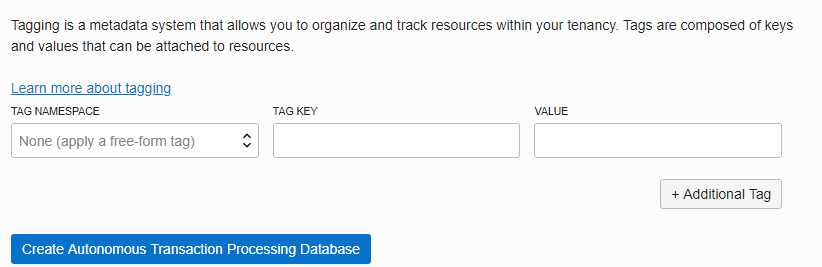

You will be placed on the Database Details page and your database will be in
“**Provisioning**” status. The Database Details page displays more information
about your instance, notice the various menu buttons that help you manage your
new instance.

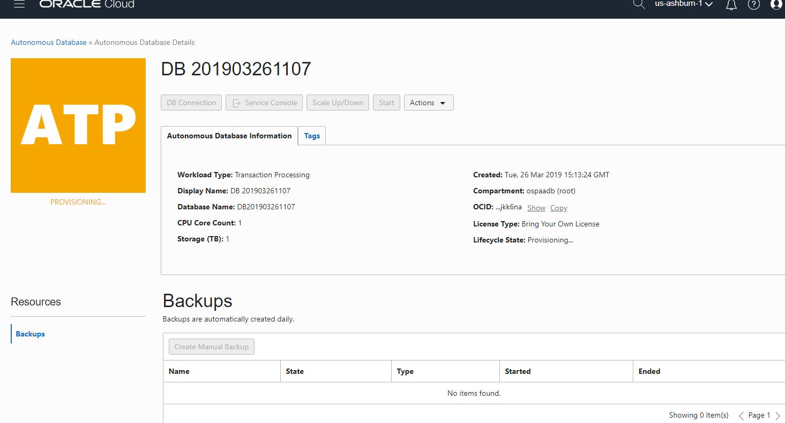

The status will automatically change to “**Available**” when the database is
ready in a few minutes…Your Autonomous database is up and running! Take notice
of the green color of the ATP logo indicating the service is available and
commands to start, stop, terminate, and scale the service.

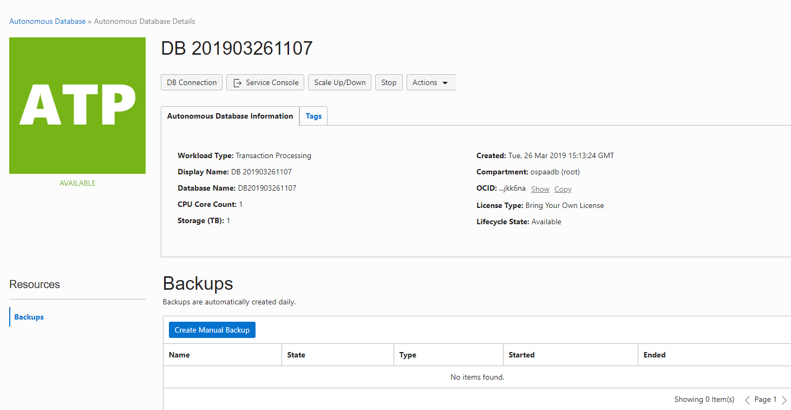

Now connect to your database, click the Service Console button:

You will be placed in the Service Console page, you will notice there is no
activity displayed because this is a new instance. Select the **Administration**
option from the left:

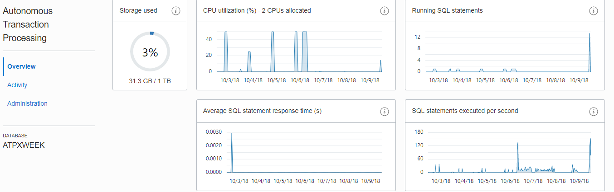

On the administration page there are six options:

**Download Client Credentials (Wallet) –** this contains the credentials files
used for connectivity to the instance from client applications, tools

**Set Administrator Password –** used to change the “Admin” account password

**Download Oracle Instant Client –** points to different clients that can be
used to connect to the database (like sql\*plus)

**Set Resource Management Rules –** ATP has pre-created user resource groups,
those can be managed here

**Manage Oracle ML Users –** Notebook development environment that can be used
with ATP

**Send Feedback to Oracle –** email feedback on ATP

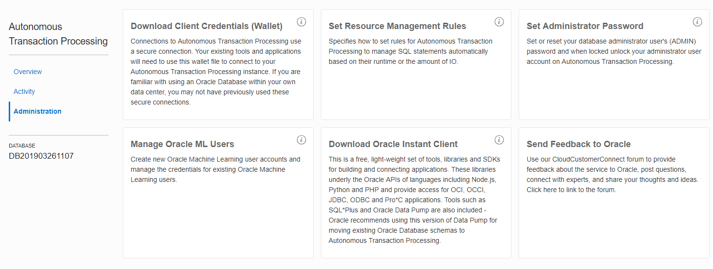
