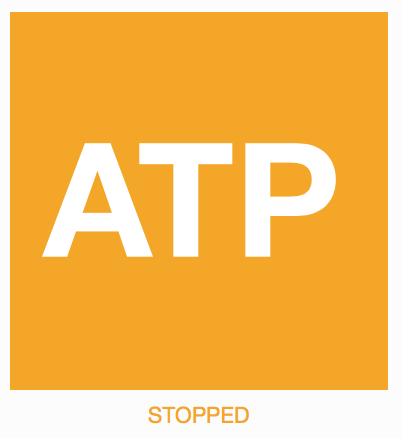
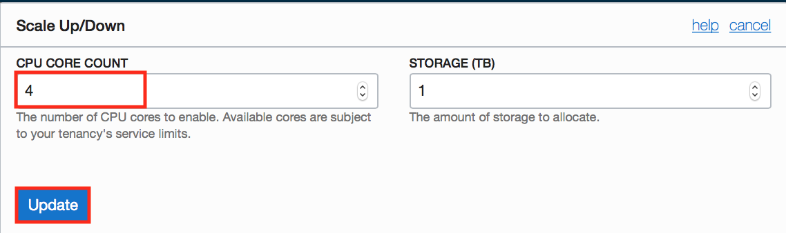
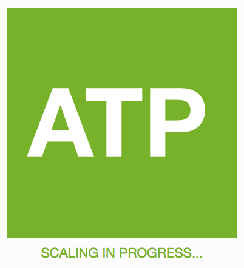

Start, Stop and Scale Autonomous Database
-----------------------------------------

This section outlines the management activities that you would typically perform
on Oracle Autonomous Database. Tasks such as starting and stopping the service
and scaling the service are covered.

### Objectives

-   Start and Stop the ADB service

-   Scale the ADB service

### Lab Steps

### Stopping ATP Service

-   Sign in to your ADB **Service Console** and browse to the **Autonomous
    Database Details** page of your service.

-   Click **Stop** to stop the service.

-   Click **Stop** again when prompted for confirmation.

-   The ADB service will take a few seconds to stop. Notice the status of
    **STOPPING**.

-   When the service is stopped, the status will change to **STOPPED**.

### Starting ADB Service

-   From the **Details** page of your ADB service, click **Start** to start your
    service.

-   Click **Start** again when prompted for confirmation.

-   The ADB service will take a few seconds to start. For example, if you
    provisioned ATP service, you would notice the status of **STARTING** as
    follows:

-   When the service is started, the status will change to **AVAILABLE**.

### Scaling ADB Service

-   From the **Details** page of your ADB service, click **Scale Up/Down** to
    scale your service.

-   In the **Scale Up/Down** pop up, modify the **CPU CORE COUNT** to **4** and
    click **Update**.

-   The ADB service will take a few seconds to scale. Notice the status of
    **SCALING IN PROGRESS**.

-   Note that the ATP square remains green during the scaling process. No
    interruption to the service occurs during all scaling operations.

-   When the scaling task is complete, the status will change to **AVAILABLE**.

-   Note the new **CPU Core Count** is reflected in the service details.

